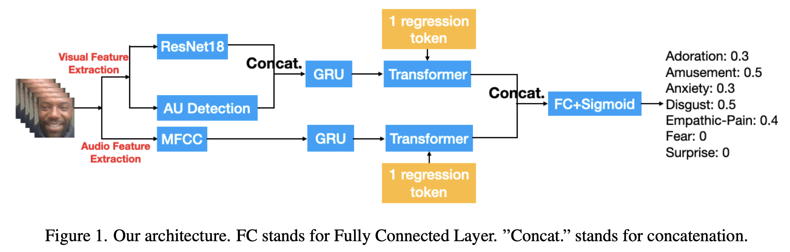
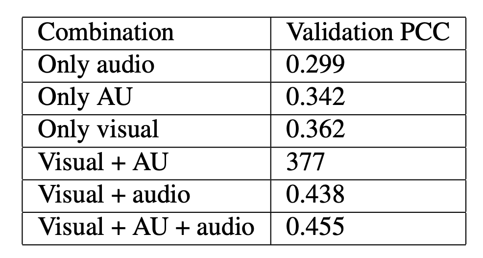

### Multi-modal Emotional Reaction Intensity Estimation Incorporating Action Unit Infomation


### prepare features and run
```
# 1. use openface to crop face images and get AUs
# 2. extract expression features

python tools/extract_features.py

# 3. extract mfcc features
python tools/extract_mfcc2.py

# 4. train multi-modal model with vision and audio  features
bash train_feats.sh vamm
```

### framework


### performance
